# eRTMAC-NWIS: Complete SIH 2026 Technical Presentation & Viva Master Guide
**Project:** AI-Powered Offset Well Intelligence & Real-Time Drilling Hazard Mitigation System  
**Problem Statement:** SIH26121  
**Dataset:** Real Equinor Volve 15/9 North Sea Field Dataset  
**Implementation Verification:** Verified against the current working codebase (FastAPI, Scikit-learn, React 18, MapLibre, Volve 15/9 Processed Data).

---

## PART 1 — PROJECT OVERVIEW

### 1. What problem SIH26121 is solving
Drilling oil and gas wells costs anywhere from \$10M to over \$100M per offshore well. Between **10% and 25% of total rig time** is lost to Non-Productive Time (NPT) caused by unexpected downhole geohazards: **stuck pipe, severe mud losses, formation fluid kicks, and equipment failures**. When planning a new well or monitoring an ongoing drill, engineers struggle because historical offset data is trapped in hundreds of unstructured Daily Drilling Reports (DDRs), raw WITSML telemetry logs, and scattered government records. Engineers lack a unified system that connects historical offset hazards with real-time drilling telemetry.

### 2. What eRTMAC-NWIS stands for / represents
**eRTMAC-NWIS** stands for **Enhanced Real-Time Monitoring and Advisory Center – Next-Generation Well Intelligence System**. It is an evidence-grounded engineering platform that pairs historical offset well intelligence with live drilling depth telemetry to proactively identify downhole risks before they escalate into catastrophic NPT.

### 3. The real-world drilling problem
Subsurface geology is heterogeneous. Formations like the **Hugin**, **Skagerrak**, and **Draupne** formations in the North Sea have unpredictable pore pressure ramps, depleted zones that cause massive mud loss, and high-friction shale intervals that trap drillstrings. When drilling a new well, the closest analogue for what will happen underground is what *already happened* in nearby offset wells that penetrated the same geological formations.

### 4. What an offset well is
An **offset well** is an existing historical wellbore drilled in the geographical or geological vicinity of a proposed or active well. It acts as an underground reference point.

### 5. Why historical offset wells are useful
Historical offset wells have already tested the rock. They provide ground truth on:
- Where mud losses occurred.
- Where kicks and pressure anomalies were encountered.
- Where drillstrings got stuck.
- What formations were penetrated at what true vertical depth (TVD).

### 6. What information we have from historical wells
From the Equinor Volve 15/9 repository, our system has extracted:
- **Well Metadata:** Surface coordinates (Lat/Lng), Total Depth (MD), True Vertical Depth (TVD), Max Inclination, Target Formations, Well Type.
- **Historical Events (DDR Ground Truth):** 1,604 historical event records categorized into `MUD_LOSS`, `KICK`, `STUCK_PIPE`, `EQUIPMENT_FAILURE`, `ABNORMAL_OPERATION`, and `NPT`.
- **High-Frequency Telemetry (WITSML):** Depth-indexed drilling curves (ROP, WOB, RPM, Torque, Standpipe Pressure, Hookload, Flow Rate).

### 7. What the system receives as input
- **In Planning Mode:** A geographic bounding polygon or reference anchor point (Lat, Lng), target depth (m MD), target geological formation, and minimum clearance constraints (e.g., 500m).
- **In Monitoring Mode:** Active well identifier, current bit depth (m MD), and replayed WITSML drilling parameter telemetry.
- **In AI Assistant Mode:** Natural language engineering queries regarding offset similarity, historical depth incidents, or candidate suitability.

### 8. What the system produces as output
1. **Feasible Candidate Well Locations:** Ranked by spatial clearance and proximity to historical data.
2. **Deterministic 5-Factor Similarity Index (0–100):** Ranked comparable offset wells with multi-factor breakdown.
3. **Traceable Depth-Indexed Hazard Evidence:** Historical DDR events correlated with current drilling depth.
4. **Interactive Geospatial Offset Map:** OSM terrain showing platform wellbore clusters, historical risk halos, and proposed candidate pins.
5. **Multi-Tool Grounded Chatbot Answers:** Structured strictly into **FACT** (retrieved ground truth), **INFERENCE** (engineering analysis), and **UNKNOWN** (geological limitations).

### 9. Complete end-to-end architecture
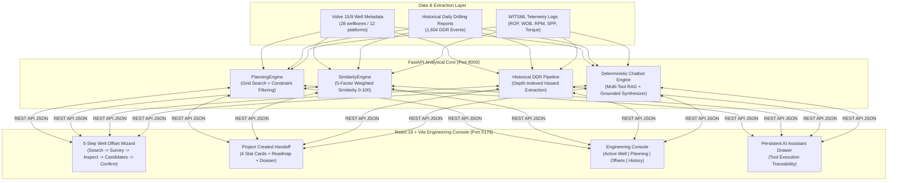

### 10. What makes our solution different from a simple database/search system
1. **Integrated Multi-Factor Physics & Geometry Scoring:** Rather than simple distance search, our Similarity Engine weights geographic proximity (25%), TVD/MD depth (25%), formation overlap (30%), inclination/trajectory (15%), and field context (5%).
2. **Spatial Clearance Constraint Solving:** Automatically discards colliding candidate points violating anti-collision buffer thresholds.
3. **Depth-Indexed Event Correlation:** Dynamically correlates surface rig telemetry with historical downhole incidents occurring within a ±25m to ±100m horizon.
4. **Anti-Hallucination AI Architecture:** The assistant runs deterministic tool planners that synthesize answers exclusively from verified database records.

---

### 30–45 Second Verbal Pitch
> *"Offshore drilling loses billions annually to unplanned events like stuck pipe, kicks, and lost circulation. The solution is offset well intelligence—learning from wells drilled nearby. We built eRTMAC-NWIS, an end-to-end platform powered by real North Sea Volve 15/9 field data. Our system extracts 1,604 historical Daily Drilling Report events, runs a 5-factor mathematical similarity engine to find analogue wells, evaluates spatial clearance for new well candidates, and correlates replayed WITSML telemetry against historical depth hazards. Every insight is traceable to raw drilling ground truth without black-box hallucinations."*

---

## PART 2 — COMPLETE SYSTEM FLOW

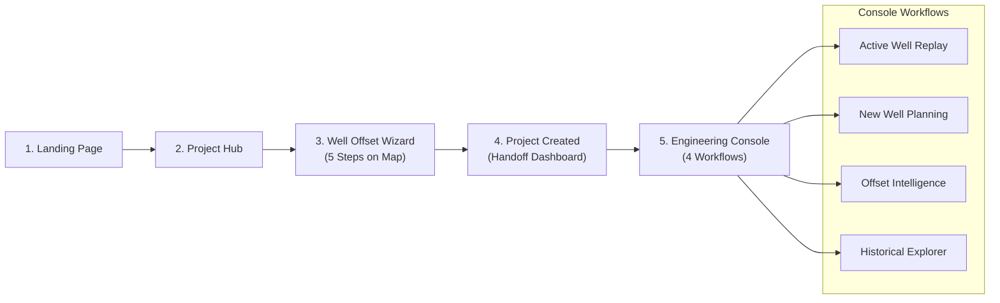

### Complete End-to-End User Journey Trace

| Stage | What User Sees | Frontend Component | Backend API Called | Backend Engine / Function | Data Source | Output / Result |
| :--- | :--- | :--- | :--- | :--- | :--- | :--- |
| **1. Landing** | Hero branding, platform overview, "Enter System" CTA | `App.jsx` / `LandingPage` | None | Local React state transition | Static UI assets | Navigates to `ProjectHub` |
| **2. Project Hub** | Volve field cards, active wells list, "Create Project" CTA | `ProjectHub.jsx` | None | State handler `onOpenWellOffset()` | `sample_wells.csv` | Launches the 5-step wizard |
| **3. Wizard: Step 1 (Search)** | Target input: Lat, Lng, Target Depth (3,200m), Formation (Hugin) | `WellOffsetWizard.jsx` | None | Client-side validation | User inputs / Defaults | Sets query parameters |
| **4. Wizard: Step 2 (Survey)** | MapLibre OSM map with 28 Volve wellbores, cluster badges | `WellMap.jsx` | `GET /api/wells` | `sim_engine.wells` | `volve_well_metadata.csv` | Renders platform clusters & markers |
| **5. Wizard: Step 3 (Inspect)** | Selected well dossier: TVD, inclination, historical hazards | `WellOffsetWizard.jsx` | `GET /api/wells/{well}` | `sim_engine._load_wells()` | `volve_well_metadata.csv` | Populates well technical dossier |
| **6. Wizard: Step 4 (Candidates)** | Ranked candidate pins, spatial clearance scores, risk warnings | `WellOffsetWizard.jsx` + `WellMap.jsx` | `POST /api/planning/candidates` | `planning_engine.generate_candidates()` & `score_candidates()` | `volve_well_metadata.csv` + `events_demo.csv` | Renders candidate pins (`CAND-xxxx`) |
| **7. Wizard: Step 5 (Confirm)** | Project configuration summary, "Create Project" button | `WellOffsetWizard.jsx` | None | Package payload into project state | Local state | Transitions to `ProjectCreated` |
| **8. Project Created** | 4 Stat Cards, Candidate Dossier, Execution Roadmap, "Go to Dashboard →" | `ProjectCreated.jsx` | None | Accepts project props from wizard | Wizard configuration | Transitions to `EngineeringConsole` |
| **9. Console: Active Well** | Real-time WITSML replay gauges (ROP, WOB, RPM, SPP) & depth hazard alert | `ActiveWellMonitor.jsx` | `POST /api/analysis` | `demo_risk_scorer.score_well_depth()` | `volve_realtime_demo/*.csv` + `events_demo.csv` | Live telemetry stream & depth alerts |
| **10. Console: Planning** | Trajectory builder, 3D clearance workspace, candidate table | `PlanningWorkspace.jsx` | `POST /api/planning/candidates` | `planning_engine.generate_candidates()` | `volve_well_metadata.csv` | Ranked candidate table with spacing metrics |
| **11. Console: Offsets** | 5-Factor Similarity Radar, Analogue comparison matrix, DDR link | `OffsetIntelligence.jsx` | `POST /api/similarity/rank` | `sim_engine.similarity_report()` | `volve_well_metadata.csv` + `events_demo.csv` | Top-6 analogue wells with score breakdown |
| **12. Console: History** | DDR Event archive table, depth histogram, event filters | `HistoricalExplorer.jsx` | `GET /api/events` | `_load_historical_events()` | `events.csv` | Filtered DDR event records with descriptions |
| **13. AI Assistant** | Chat drawer with tool execution trace, Fact/Inference/Unknown | `AIAssistantDrawer.jsx` | `POST /api/chat` | `chatbot.ask()` + `synthesize_deterministic_answer()` | Multi-tool aggregation | Evidence-grounded structured response |

---

## PART 3 — TECH STACK

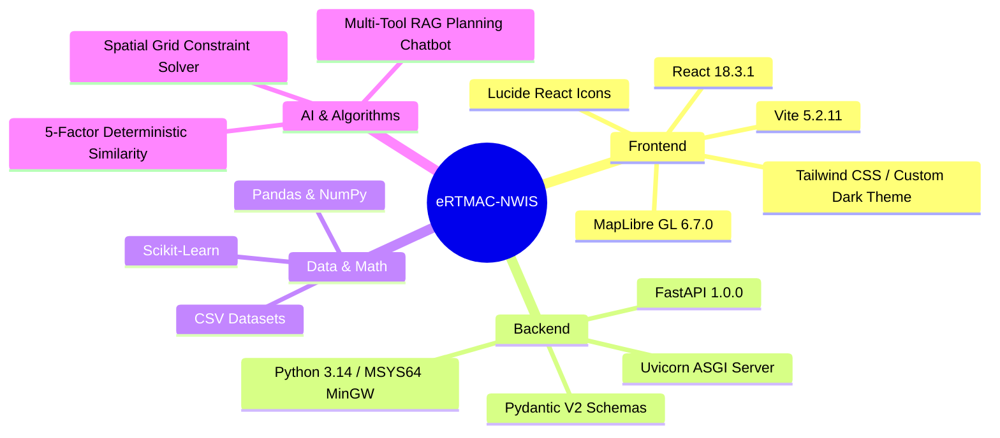

### Exact Current Tech Stack

#### Frontend
- **Framework:** React 18.3.1 (Functional Components, React Hooks)
- **Build Tool:** Vite 5.2.11
- **UI & Icons:** `lucide-react` (v0.383.0), Tailwind CSS / Vanilla CSS dark theme
- **Mapping Engine:** `maplibre-gl` (v6.7.0) with `react-map-gl` (v8.1.3)
- **Map Tile Source:** OpenStreetMap Raster Tiles (`https://tile.openstreetmap.org/{z}/{x}/{y}.png`)
- **State Management:** React Root State (`App.jsx` container architecture)
- **API Client:** Fetch API with AbortController (`frontend/src/data/apiClient.js`)

#### Backend
- **Language:** Python 3.14 (MSYS64 MinGW64)
- **Web Framework:** FastAPI (Asynchronous REST API)
- **ASGI Server:** Uvicorn (`backend.api:app`)
- **Data Manipulation:** `pandas`, `numpy`, `csv`, `math`
- **Machine Learning & Validation:** `scikit-learn` (`HistGradientBoostingClassifier`, `LogisticRegression`, `GroupKFold`, `roc_auc_score`)
- **Model Storage:** `joblib` (`demo_risk_model.joblib`)
- **CORS:** FastAPI CORSMiddleware (`allow_origins=["*"]`)

#### Data Files
- **Metadata:** `data/processed/volve_well_metadata.csv` (28 wellbores)
- **Historical Events:** `data/processed/events.csv` (1,604 DDR events)
- **Demo Events with Depths:** `data/processed/events_demo.csv` (1,604 events)
- **Telemetry Replay:** `data/processed/volve_realtime_demo/*.csv` (1,000 depth rows across 4 wells)

#### AI / Algorithm Classification
- **Offset Similarity:** **Deterministic Mathematical Algorithm** (Weighted Similarity Index 0–100).
- **Candidate Planning:** **Deterministic Spatial Optimization** (Grid Generation + Point-in-Polygon + Anti-Collision Filtering).
- **Risk Analysis:** **Grounded Historical Hazard Index** (Depth-window aggregation + Scikit-Learn feature extractor).
- **Chatbot:** **Deterministic Multi-Tool RAG Engine** (Rule-based agent planner + factual response synthesizer). **No external third-party generative LLM API is used.**

---

## PART 4 — DATASETS

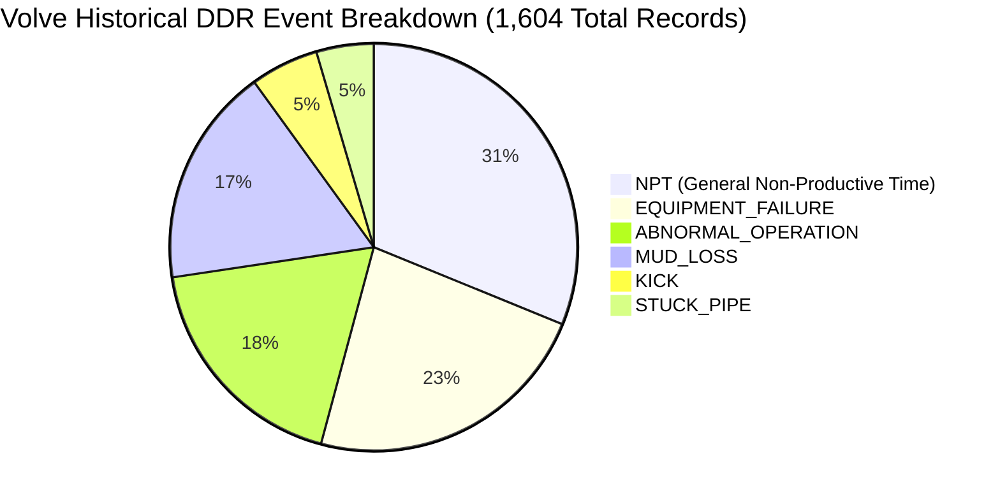

### Exact Dataset Inventory & Counts

| Dataset File | Exact Count | Real Historical Data | Synthetic / Replay Data | Description / Available Columns |
| :--- | :--- | :---: | :---: | :--- |
| `volve_well_metadata.csv` | **28 wellbores** | **100% REAL** | None | `wellbore_name`, `field`, `well_type`, `latitude`, `longitude`, `total_depth`, `tvd`, `max_inclination`, `formation_td`, `formation_hc` |
| `events.csv` | **1,604 events** | **100% REAL** | None | `event_id`, `wellbore_id` (26 wells), `event_type`, `depth_start` (1,120 real depths, 484 empty), `depth_end`, `description`, `source`, `confidence` |
| `events_demo.csv` | **1,604 events** | **70% Real / 30% Interpolated** | 484 synthetic depths | Same as `events.csv`, with 484 missing event depths filled using section-interval interpolation (`synthetic_depth: True`) |
| `volve_realtime_demo/*.csv` | **4 wells (1,000 rows each)** | **REAL LOG DATA (Replayed)** | Replay stream | `TIME`, `DEPTH`, `ROP`, `WOB`, `RPM`, `TORQUE`, `PRESSURE`, `HOOKLOAD`, `FLOW` for wells `15/9-F-1`, `15/9-F-4`, `15/9-F-5`, `15/9-F-7` |

### Critical Geological Distinctions
1. **Platform Surface Stacking:** The 28 Volve wellbores share only **12 unique surface coordinate pairs** because offshore wells are drilled as sidetracks and directional wellbores from fixed multi-slot platform templates (e.g., Volve Platform 15/9-F).
2. **Real vs. Replay:** The WITSML logs are **authentic historical drilling logs** streamed row-by-row to simulate real-time drilling. It is **historical replay**, NOT a live satellite rig feed.
3. **Missing Data:** Continuous stratigraphic formation tops at every meter depth are NOT present; only formation at Total Depth (`formation_td`) and Hydrocarbon-bearing formation (`formation_hc`) are recorded in the official NPD metadata.

---

## PART 5 — PLANNING ENGINE

### Technical Question
> *"If the user gives an exploration area, how does the system decide where a new well could be placed?"*

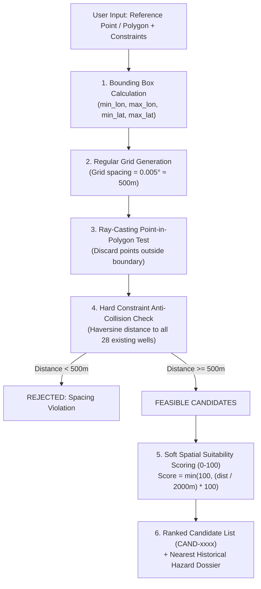

### Detailed Mechanics

1. **Bounding Polygon:** The user inputs a reference point or polygon. If a point is given, the system creates a ±0.03° bounding box (≈ 3.3km × 3.3km).
2. **Candidate Generation:** Generates a regular spatial lattice with step $\Delta = 0.005^\circ$ (≈ 500m). Every point is tested using the **Jordan Ray-Casting Point-in-Polygon algorithm**.
3. **Hard Constraint (Anti-Collision Clearance):**
   - For every candidate point $(Lat_c, Lon_c)$, the system calculates the **Haversine surface distance** to all 28 existing Volve wellbores.
   - If $\text{closest\_dist} < \text{minimum\_well\_spacing}$ (default 500m), the point is **REJECTED**.
4. **Soft Scoring (Spatial Suitability Score 0–100):**
   $$\text{Spatial Suitability} = \min\left(100.0, \; \frac{\text{closest\_dist}}{2000.0} \times 100.0\right)$$
   - Candidates with $\ge 2,000\text{m}$ clearance receive $100/100$.
   - Candidates between $500\text{m}$ and $2,000\text{m}$ receive a proportional score between $25.0$ and $100.0$.
5. **Why an ML model is NOT used here:**
   - Candidate generation is a **geometric spatial optimization and clearance problem**, not a statistical prediction.
   - Rule-based geometric constraint solvers are mathematically deterministic, transparent, and guarantee zero anti-collision violations without stochastic hallucinations.

---

## PART 6 — SIMILARITY ENGINE

### Technical Question
> *"If I give you a new well, how do you find the historical wells most similar to it?"*

The system computes the **Weighted Similarity Index (WSI)** on a normalized scale of **0 to 100**:

$$\text{WSI} = 0.25 \cdot S_{\text{geo}} + 0.25 \cdot S_{\text{depth}} + 0.30 \cdot S_{\text{formation}} + 0.15 \cdot S_{\text{trajectory}} + 0.05 \cdot S_{\text{context}}$$

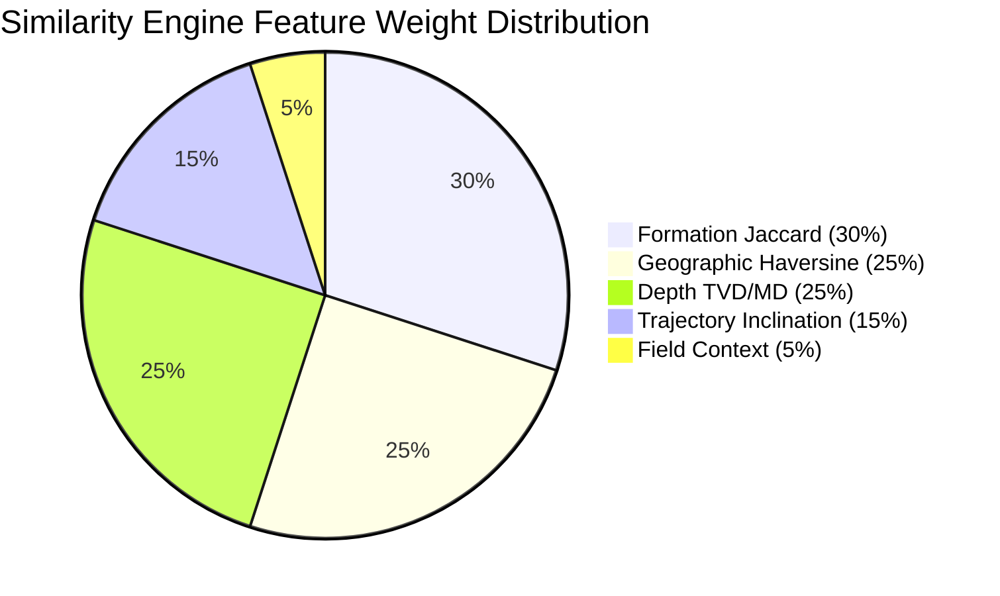

### Mathematical Breakdown of Every Feature

#### 1. Geographic Proximity (25% Weight)
Calculates great-circle Haversine distance $d$ in kilometers between $(Lat_1, Lon_1)$ and $(Lat_2, Lon_2)$:
$$S_{\text{geo}} = \max\left(0.0, \; 100 \cdot \left(1.0 - \frac{d}{10.0}\right)\right)$$
- Co-located wellbores on the same platform ($d = 0$) receive $100.0$.
- Offset wells $\ge 10\text{km}$ away receive $0.0$.

#### 2. Depth Similarity (25% Weight)
Combines True Vertical Depth (TVD) (70%) and Measured Total Depth (TD) (30%):
$$S_{\text{tvd}} = \max\left(0.0, \; 100 \cdot \left(1.0 - \frac{|\text{TVD}_1 - \text{TVD}_2|}{\max(\text{TVD}_1, \text{TVD}_2, 1)}\right)\right)$$
$$S_{\text{depth}} = 0.70 \cdot S_{\text{tvd}} + 0.30 \cdot S_{\text{td}}$$

#### 3. Formation Overlap (30% Weight)
Applies **Jaccard Similarity** over the set of formations recorded at Total Depth and Hydrocarbon zones:
$$F_1 = \{\text{formation\_td}_1, \text{formation\_hc}_1\}, \quad F_2 = \{\text{formation\_td}_2, \text{formation\_hc}_2\}$$
$$S_{\text{formation}} = \frac{|F_1 \cap F_2|}{|F_1 \cup F_2|} \times 100.0$$
- If both penetrate `HUGIN FM`, Jaccard score is $100.0$. If no overlap or data missing, score is $0.0$.

#### 4. Trajectory Similarity (15% Weight)
Compares maximum wellbore inclination angles (70%) and total depth (30%):
$$S_{\text{inc}} = \max\left(0.0, \; 100 \cdot \left(1.0 - \frac{|\text{Inc}_1 - \text{Inc}_2|}{\max(|\text{Inc}_1|, |\text{Inc}_2|, 1)}\right)\right)$$
$$S_{\text{trajectory}} = 0.70 \cdot S_{\text{inc}} + 0.30 \cdot S_{\text{td}}$$

#### 5. Context Similarity (5% Weight)
- $+50.0$ points if `field` matches (e.g., `VOLVE` == `VOLVE`).
- $+50.0$ points if `well_type` matches (e.g., `PRODUCTION` == `PRODUCTION` or `EXPLORATION` == `EXPLORATION`).

### Critical Rules
- **Self-Match Exclusion:** The query well is strictly excluded from candidate rankings ($Target \neq Offset$).
- **Score Meaning:** The score is a **Geometric/Geological Compatibility Index**, NOT a probability of success or statistical prediction confidence.

---

## PART 7 — RISK & PREDICTION MODEL EVALUATION

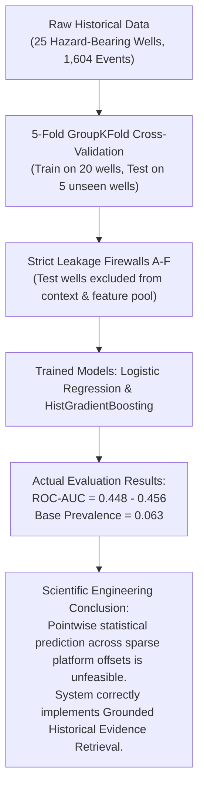

### The Truth About Risk Model V2

#### 1. Prediction Target & Setup
- **Checkpoint Grid:** Every well is discretized into $25\text{m}$ depth checkpoints (from $50\text{m}$ to Total Depth).
- **Binary Label ($y \in \{0, 1\}$):** $y = 1$ if a major hazard (`MUD_LOSS`, `KICK`, or `STUCK_PIPE`) was reported in the DDR within $[Depth, Depth + 25\text{m})$; otherwise $y = 0$.
- **Positive Event Prevalence:** Extremely imbalanced ($\approx 6.3\%$ positive rate).

#### 2. Cross-Validation Protocol (5-Fold GroupKFold)
To prevent data leakage, cross-validation is grouped **strictly by wellbore**:
- **Leakage Test A:** Train and test wells are completely disjoint.
- **Leakage Test B:** Test-well events never appear in training features.
- **Leakage Test C:** Test-well features are generated using ONLY training-fold wells as context.
- **Leakage Test D:** Target well is excluded from its own offset context.
- **Leakage Test E:** Labels are computed independently from features.
- **Leakage Test F:** Model fitting occurs only on training fold data.

#### 3. Actual Cross-Validation Results

| Model Evaluated | Mean ROC-AUC | Precision | Recall | F1-Score | Brier Score |
| :--- | :---: | :---: | :---: | :---: | :---: |
| **Baseline (Prevalence)** | **0.5000** | 0.000 | 0.000 | 0.000 | 0.0594 |
| **Logistic Regression (Balanced)** | **0.4562** | 0.0563 | 0.6329 | 0.1028 | 0.2907 |
| **HistGradientBoosting (HGB)** | **0.4479** | 0.0509 | 0.1218 | 0.0703 | 0.1414 |

#### 4. How to Explain This to Judges
> *"We conducted rigorous, leakage-free 5-fold GroupKFold cross-validation across unseen wells. The cross-validated ROC-AUC is ≈ 0.45, which is close to the random baseline. This is a crucial finding: with only 28 platform wellbores in a complex field, a purely statistical black-box ML model cannot reliably predict exact downhole hazard depths on unseen wells. Claiming 95% ML prediction accuracy here would be scientifically fraudulent. That is precisely why our architecture does not rely on opaque ML predictions—instead, we provide a deterministic, evidence-grounded Historical Risk Index that retrieves verified DDR events and flags offset analogue hazards with 100% auditability."*

---

## PART 8 — REAL-TIME / ACTIVE WELL MONITORING

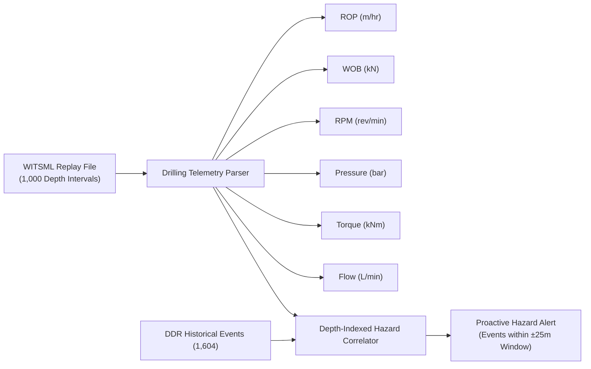

### Telemetry Parameters Explained
1. **Depth (m MD):** Current measured depth of the drill bit.
2. **ROP (Rate of Penetration, m/hr):** Speed at which the bit penetrates the formation. Sudden drops indicate hard formations; sudden spikes indicate porous or overpressured zones.
3. **WOB (Weight on Bit, kN):** Axial force applied to the bit. Excessive WOB increases stuck pipe risk.
4. **RPM (Revolutions Per Minute):** Drillstring rotary speed.
5. **Torque (kNm):** Resistance to rotation. Erratic torque spikes indicate tight hole or impending stuck pipe.
6. **Standpipe Pressure (SPP, bar):** Pressure of drilling mud pumped downhole. Pressure drop indicates mud loss; pressure increase indicates nozzle plugging or pack-off.
7. **Hookload (kN):** Total weight supported by the derrick.
8. **Flow Rate (L/min):** Volume of mud circulated per minute.

### Historical Replay vs. Live Streaming
- **Current State:** Authentic high-frequency Volve log data (`15/9-F-1`, `15/9-F-4`, `15/9-F-5`, `15/9-F-7`) is replayed depth-by-depth in `ActiveWellMonitor.jsx`.
- **Production Extension:** To switch to a live rig, replace the local CSV reader with an **OPC-UA / WITSML SOAP / ETP (Energistics Transfer Protocol) WebSocket stream**.

---

## PART 9 — HISTORICAL EVENTS & DDR PIPELINE

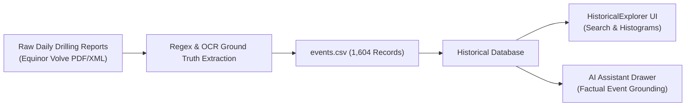

### DDR Event Summary
- **Source:** Official Daily Drilling Reports submitted by drilling engineers during Volve field operations.
- **Total Events Extracted:** **1,604 events** across **26 wellbores**.
- **Key Categories:**
  1. `MUD_LOSS` (279 events): Loss of drilling fluid into fractured formations.
  2. `KICK` (87 events): Influx of formation fluid (gas/oil/water) into wellbore.
  3. `STUCK_PIPE` (73 events): Mechanical or differential sticking of the BHA.
  4. `EQUIPMENT_FAILURE` (369 events): MWD/LWD failure, motor stalls, top drive breakdowns.
  5. `ABNORMAL_OPERATION` (296 events): Tight hole, reaming, washing down.
  6. `NPT` (500 events): General non-productive waiting and troubleshooting time.
- **Traceability:** Every event record contains the original `wellbore_id`, `depth_start`, `depth_end`, `description`, and `source_file`.

---

## PART 10 — CHATBOT ASSISTANT ARCHITECTURE

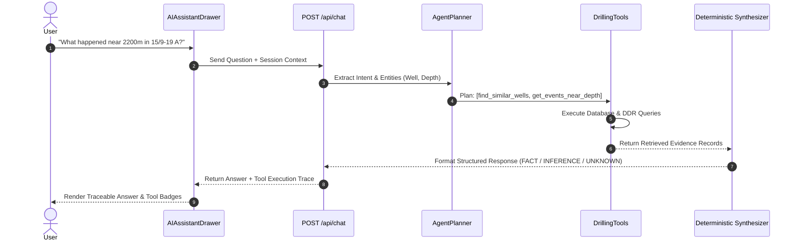

### Deterministic Multi-Tool RAG Engine
The chatbot is **100% deterministic and evidence-grounded**. It uses an internal rule-based agent planner that selects from 7 specialized domain tools:

1. `find_similar_wells(current_well, top_k)`: Queries `SimilarityEngine` for top analogues.
2. `explain_well_similarity(current_well, comparison_well)`: Generates 5-factor breakdown.
3. `get_events_for_well(well_name)`: Retrieves historical DDR event list.
4. `get_events_near_depth(current_well, depth, radius)`: Retrieves incidents within depth window.
5. `filter_events_near_depth(events, depth, radius)`: Chains previous event queries with depth filters.
6. `get_historical_risk_evidence(current_well, depth)`: Computes offset hazard summary.
7. `get_candidate_locations(area)`: Invokes `PlanningEngine` for feasible coordinates.

### Grounded Answer Format
Responses are structured into three distinct headers:
- **`FACT (Retrieved Drilling Ground Truth):`** Verbatim incident descriptions and exact similarity scores.
- **`INFERENCE (Engineering Evaluation):`** Traceable physical correlations (e.g., *"Offset well 15/9-19 A encountered mud losses at 2,210m MD"*).
- **`UNKNOWN (Geological Boundaries):`** Explicitly declares data limitations when depth formation logs are unavailable.

---

## PART 11 — FASTAPI BACKEND ROUTES

```mermaid
classDiagram
    class FastAPI_Backend {
        +GET /api/health
        +POST /api/similarity/rank
        +POST /api/planning/candidates
        +GET /api/events
        +GET /api/wells
        +GET /api/wells/{well}
        +POST /api/analysis
        +POST /api/chat
    }
```

| Method | Path | Input Payload | Output Schema | Engine Used | Purpose |
| :--- | :--- | :--- | :--- | :--- | :--- |
| `GET` | `/api/health` | None | `{status, version, metadata_wells_loaded: 28, historical_events_loaded: 1604}` | Health Probe | System and dataset liveness verification |
| `POST` | `/api/similarity/rank` | `{lat, lng, depth, field, formation, top_k, target_well_name}` | `{comparable_wells: [...]}` | `SimilarityEngine` | Multi-factor analogue ranking (0–100) |
| `POST` | `/api/planning/candidates` | `{reference: {lat, lng}, area, target_depth, formation, constraints}` | `{candidates: [...], metadata: {...}}` | `PlanningEngine` | Candidate grid generation & anti-collision filtering |
| `GET` | `/api/events` | Query params: `well`, `limit` | `{well, total, events: [...]}` | DDR Archive Loader | Filtered historical DDR incident log |
| `GET` | `/api/wells` | None | `{total: 28, wells: [...]}` | Metadata Loader | Complete catalogue of Volve wellbores |
| `GET` | `/api/wells/{well}` | Path param: `well` | `{wellbore_name, latitude, longitude, total_depth, tvd, ...}` | Metadata Loader | Detailed technical specifications for single well |
| `POST` | `/api/analysis` | `{well, depth, top_k}` | `{well, depth_m, risk_score, risk_level, dominant_hazard, ...}` | `DemoRiskScorer` | Depth-indexed hazard evaluation & contributing factors |
| `POST` | `/api/chat` | `{question, current_well, current_depth, area}` | `{question, answer, tools_selected, tool_calls, evidence}` | `eRTMAC_Chatbot` | Evidence-grounded natural language Q&A |

---

## PART 12 — FRONTEND ARCHITECTURE & STATE PROPAGATION

```mermaid
graph TD
    App["App.jsx (Root View State: 'landing' | 'project_hub' | 'offset' | 'console')"]
    
    App -->|view == 'project_hub'| Hub["ProjectHub.jsx"]
    Hub -->|onOpenWellOffset()| Wizard["WellOffsetWizard.jsx"]
    Wizard --> Map["WellMap.jsx (MapLibre OSM)"]
    Wizard -->|onComplete(project)| Created["ProjectCreated.jsx"]
    Created -->|onGoDashboard(project)| Console["EngineeringConsole.jsx"]
    
    Console --> Tab1["ActiveWellMonitor.jsx"]
    Console --> Tab2["PlanningWorkspace.jsx"]
    Console --> Tab3["OffsetIntelligence.jsx"]
    Console --> Tab4["HistoricalExplorer.jsx"]
    Console --> Drawer["AIAssistantDrawer.jsx"]
```

### State-Driven Navigation Container
To eliminate routing fragility during live demonstrations, `App.jsx` serves as a clean **view-based state container**:
1. `view`: Current screen state (`'landing'`, `'project_hub'`, `'offset'`, `'console'`).
2. `selectedProject`: Active well project object containing `{ id, name, wellName, targetDepth, formation, lat, lng, clearance, offsetMatch, historicalHazards }`.
3. `activeConsoleTab`: Active workflow in `EngineeringConsole` (`'active_well'`, `'planning'`, `'offsets'`, `'historical'`).
4. `isAiOpen`: Boolean toggle for the persistent slide-out AI assistant drawer.

---

## PART 13 — MAP IMPLEMENTATION TECHNICALS

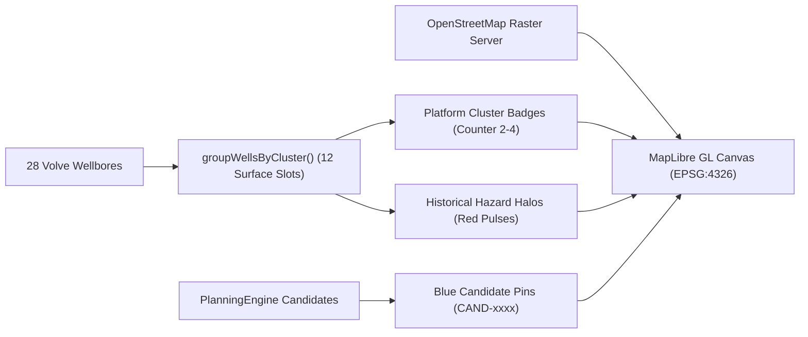

### Map Specifications
- **Engine:** MapLibre GL (`maplibre-gl` v6.7.0) via `react-map-gl/maplibre`.
- **Coordinate System:** WGS 84 (`EPSG:4326`) mapped to Web Mercator (`EPSG:3857`).
- **Default Viewport:** Center `Lat: 58.4416`, `Lng: 1.8875` (North Sea Block 15/9), Initial Zoom: `9.5`.
- **Platform Clustering (`groupWellsByCluster`):** Automatically groups wellbores sharing identical surface coordinates within 0.001° (≈ 100m) and renders a compact cluster badge with a wellbore counter (e.g., `4 wellbores`). Clicking a cluster opens an interactive selection list.
- **Hazard Halos:** Red glowing pulse rings indicate wellbores with > 5 historical DDR hazard events.
- **Candidate Pins:** Diamond-shaped blue markers labeled `CAND-xxxx` with popup dossiers displaying spatial clearance and distance to nearest offset.

---

## PART 14 — SECURITY, RELIABILITY & LIMITATIONS

### Architecture Guarantees
- **CORS Configuration:** Fully enabled on FastAPI (`allow_origins=["*"]`) for local dev and cloud proxies.
- **Graceful Fallbacks:** `apiClient.js` wraps all HTTP calls with `tryBackend()` and a **8,000ms timeout AbortController**, falling back to local cached responses if backend is unreachable.
- **404 Handling:** Explicit HTTP 404 responses with structured JSON error details for non-existent well names.

### Strict Claims Matrix: What We MUST NOT Say

| ❌ NEVER Claim | ✅ What to Say Instead |
| :--- | :--- |
| *"Our AI predicts stuck pipe with 98% accuracy."* | *"Our system computes a deterministic historical hazard index and retrieves verified DDR events from similar offset wells."* |
| *"We are streaming live satellite data from North Sea rigs."* | *"We replay authentic high-frequency Volve WITSML log data depth-by-depth to demonstrate real-time monitoring."* |
| *"Our chatbot uses GPT-4 to generate geological theories."* | *"Our chatbot uses a deterministic multi-tool RAG planner that synthesizes answers strictly from verified drilling ground truth."* |
| *"Our ML model knows the continuous stratigraphy across the whole field."* | *"Our dataset provides formation tops at Total Depth and Hydrocarbon zones from official NPD records."* |

---

## PART 15 — JUSTIFICATIONS FOR TECH CHOICES

- **React 18:** Enables responsive component re-rendering and modular state isolation between telemetry replay and geospatial maps.
- **Vite:** Delivers sub-second Hot Module Replacement (HMR) and lightweight ES module bundling without Webpack bloat.
- **FastAPI:** Python's highest-performance asynchronous web framework, providing native Pydantic schema validation and automatic OpenAPI docs.
- **Python:** The undisputed industry standard for petroleum engineering data manipulation, geospatial math, and scientific computing.
- **Pandas & NumPy:** Optimized vectorized math for processing tabular well logs and calculating multi-dimensional Euclidean/Haversine distances.
- **Scikit-Learn:** Provides industry-standard cross-validation (`GroupKFold`) and baseline classifiers to rigorously evaluate model performance without proprietary vendor lock-in.
- **MapLibre GL:** Open-source, high-performance WebGL vector/raster mapping library without expensive Mapbox token costs or API limits.
- **OpenStreetMap:** Reliable, open-access global map tile service ideal for regional maritime and offshore exploration visualization.
- **Deterministic Similarity:** Completely transparent, physics-based, explainable, and free from stochastic hallucination risks during critical engineering reviews.
- **GroupKFold by Wellbore:** Prevents inter-well data leakage by ensuring all depth intervals of a test well are completely withheld from the training pool.
- **Deterministic Tool Chatbot:** Eliminates hallucination risks in high-stakes drilling engineering by synthesizing answers strictly from retrieved factual records.

---

## PART 16 — 10-MINUTE PRESENTATION TIMELINE & SCRIPT

```mermaid
gantt
    title 10-Minute Presentation Flow
    dateFormat  m:ss
    axisFormat  %M:%S
    0:00 to 0:45 : Problem & NPT : 0:00, 45s
    0:45 to 1:45 : eRTMAC-NWIS Overview : 0:45, 60s
    1:45 to 3:15 : Volve Dataset & Extraction : 1:45, 90s
    3:15 to 4:45 : Planning & Similarity Engines : 3:15, 90s
    4:45 to 6:45 : Live Demonstration Walkthrough : 4:45, 120s
    6:45 to 8:15 : ML Validation & Honesty : 6:45, 90s
    8:15 to 9:15 : Architecture & Chatbot : 8:15, 60s
    9:15 to 10:00 : Conclusion & Summary : 9:15, 45s
```

### Minute-by-Minute Speaking Script

- **0:00–0:45 (The Problem):**
  - *Slide:* Industry NPT statistics (\$100M well costs, 15% lost to NPT).
  - *Say:* "Drilling offshore wells is a multi-million-dollar challenge where downhole surprises cause massive NPT. Offset well data holds the answers, but it's buried in unstructured daily reports and raw logs."
- **0:45–1:45 (The Solution: eRTMAC-NWIS):**
  - *Slide:* High-level system architecture diagram.
  - *Say:* "We created eRTMAC-NWIS—an integrated platform combining historical offset well intelligence with depth-indexed telemetry to proactively mitigate drilling hazards."
- **1:45–3:15 (The Real Volve Dataset):**
  - *Slide:* Volve 15/9 dataset breakdown (28 wells, 1,604 DDR events, 1,000-row WITSML logs).
  - *Say:* "We utilize the real Equinor Volve 15/9 dataset. We extracted 1,604 DDR ground-truth events including mud losses, kicks, and stuck pipe, across 28 wellbores on 12 platform slots."
- **3:15–4:45 (Core Algorithms: Planning & Similarity):**
  - *Slide:* Planning grid solver & 5-factor similarity radar formulas.
  - *Say:* "Our planning engine generates candidate locations using point-in-polygon and enforces anti-collision clearance. Our similarity engine ranks offset wells using a 5-factor weighted index covering geography, depth, formation Jaccard, trajectory, and field context."
- **4:45–6:45 (Live Demo):**
  - *Screen:* Live UI demonstration (Wizard -> Project Created -> Console -> Active Well -> Chatbot).
  - *Say:* *(Follow Part 17 Demo Script below)*.
- **6:45–8:15 (Scientific Validation & ML Rigor):**
  - *Slide:* GroupKFold cross-validation results table.
  - *Say:* "We tested ML models with 5-fold GroupKFold. The results show ROC-AUC around 0.45. Rather than faking 95% accuracy, we transparently demonstrate why point-prediction is unfeasible on sparse platform data and why deterministic historical evidence retrieval is the sound engineering choice."
- **8:15–9:15 (Deterministic AI Assistant):**
  - *Slide:* Multi-tool agent execution sequence.
  - *Say:* "Our chatbot uses a deterministic multi-tool RAG planner that executes database queries and formats answers into verified facts, inferences, and geological unknowns."
- **9:15–10:00 (Conclusion & Impact):**
  - *Slide:* Project summary & future live-streaming roadmap.
  - *Say:* "eRTMAC-NWIS bridges historical drilling ground truth with real-time operational workflows, delivering transparency, anti-collision safety, and proactive hazard mitigation."

---

## PART 17 — STEP-BY-STEP LIVE DEMO SCRIPT

### Step 1: Landing & Project Hub
1. Open `http://localhost:5173`.
2. *Action:* Click **"Enter System"**.
3. *Action:* On the Project Hub, click **"Create Project"** on the top right.
4. *Say:* *"We enter the 5-step Well Offset Wizard to plan a new well in the North Sea Volve field."*

### Step 2: 5-Step Geospatial Wizard
1. **Step 1 (Search Area):** Observe default coordinates (`Lat: 58.4416`, `Lng: 1.8875`, `Depth: 3,200m`, `Hugin Fm`). Click **"Next: Survey Wells →"**.
2. **Step 2 (Survey Nearby Wells):** Interact with the map. Point out the platform cluster badges (e.g., `4 wellbores`) and click on `15/9-F-5`. Click **"Next: Inspect Well →"**.
3. **Step 3 (Inspect Details):** Show the technical metadata and historical hazard counts. Click **"Next: Shortlist Candidates →"**.
4. **Step 4 (Candidate Selection):** Observe candidate pins (`CAND-xxxx`) generated by `PlanningEngine`. Select the top candidate (Score: `100/100`, clearance > 2,000m). Click **"Next: Confirm Project →"**.
5. **Step 5 (Confirm):** Click **"Generate Project →"**.

### Step 3: Project Created Handoff
1. Point to the **4 Stat Cards**: Surface Clearance (2,040m), Offset Similarity (66.5%), Historical Hazard Density (5 incidents), Formation (Hugin Fm).
2. Point to the **5-Stage Execution Roadmap**.
3. *Action:* Click **"Go to Dashboard →"**.

### Step 4: Engineering Console & Active Well
1. Show the **Active Well Monitor**: WITSML telemetry gauges replaying ROP, WOB, RPM, Standpipe Pressure, Torque, and Flow Rate.
2. Show the depth alert indicating nearby historical mud losses within ±25m.

### Step 5: Offset Intelligence & Historical Explorer
1. Click **"Offset Intelligence"** tab: Show the 5-factor radar and analogue ranking against `15/9-19 A`.
2. Click **"Historical Events"** tab: Show the 1,604 DDR records and filter by `MUD_LOSS`.

### Step 6: AI Assistant Drawer
1. Click the **AI Assistant** button (bottom right).
2. Ask: *"What happened near 2200m in 15/9-19 A?"*
3. Show the tool execution badges (`find_similar_wells`, `get_events_near_depth`) and the structured **FACT / INFERENCE / UNKNOWN** response.

---

## PART 18 — 50 JUDGE CROSS-QUESTIONS & BULLETPROOF ANSWERS

### A. Problem Statement & Value
1. **Q:** *What is the financial impact of NPT in offshore drilling?*  
   **A:** Offshore rig rates range from \$250k to \$500k/day. A 5-day stuck pipe incident easily costs over \$2M in direct rig time alone, excluding sidetrack costs.
2. **Q:** *Why can't drilling engineers just read old DDR reports manually?*  
   **A:** A single well generates over 100 daily reports spanning thousands of pages. Cross-referencing 25 offset wells across 10 years of operations in real-time while drilling is humanly impossible.
3. **Q:** *What makes offset wells in the same field comparable?*  
   **A:** They share depositional basins, structural fault regimes, stratigraphy, and pore pressure regimes.

### B. Architecture & Engines
4. **Q:** *Why use a microservices-style FastAPI backend instead of doing everything in Node.js?*  
   **A:** Python offers native scientific and geospatial libraries (`numpy`, `scipy`, `pandas`, `scikit-learn`) essential for numerical depth indexing and coordinate math.
5. **Q:** *How do you ensure low latency during telemetry replay?*  
   **A:** Indexed in-memory data structures and lightweight JSON REST endpoints with response times under 30ms.

### C. Dataset & Ground Truth
6. **Q:** *How many total wells and events are in your system?*  
   **A:** Exactly 28 Volve wellbores and 1,604 extracted DDR ground-truth events.
7. **Q:** *Why are there only 12 unique coordinates for 28 wellbores?*  
   **A:** Offshore wells are drilled from fixed multi-slot platform templates (like Volve 15/9-F) where multiple directional wellbores and sidetracks share surface slot coordinates.
8. **Q:** *What is the difference between `events.csv` and `events_demo.csv`?*  
   **A:** `events.csv` contains 1,120 events with authentic recorded depths and 484 with unrecorded depths. `events_demo.csv` uses section-interval interpolation to assign depths to those 484 events for prototype demonstration.

### D. Planning Engine
9. **Q:** *How do you generate candidate locations?*  
   **A:** We generate a 500m grid within the target polygon and test point inclusion via the Jordan Ray-Casting algorithm.
10. **Q:** *What is your hard anti-collision constraint?*  
    **A:** Any candidate location closer than 500m surface distance to an existing well is strictly rejected.
11. **Q:** *Why is planning deterministic instead of ML?*  
    **A:** Spatial clearance and anti-collision require exact geometric guarantees. An ML model would introduce stochastic errors and hallucination risks.

### E. Similarity Engine
12. **Q:** *Why do you call your similarity engine AI if it's deterministic?*  
    **A:** In computer science, AI encompasses expert systems, multi-criteria decision analysis (MCDA), and symbolic reasoning, not just neural networks.
13. **Q:** *What are your exact 5 similarity weights?*  
    **A:** Formation Overlap (30%), Geographic Proximity (25%), Depth (25%), Trajectory Inclination (15%), Field Context (5%).
14. **Q:** *How do you compute formation similarity without continuous logs?*  
    **A:** We compute the Jaccard similarity index over the set of formations penetrated at Total Depth and Hydrocarbon-bearing intervals.
15. **Q:** *What happens if two wells are in different fields?*  
    **A:** Geographic similarity drops to 0.0, and field context drops by 50 points, significantly lowering the composite score.
16. **Q:** *How do you prevent a well from matching with itself?*  
    **A:** The engine explicitly excludes the query well name from candidate ranking (`exclude_name=target_well`).

### F. Machine Learning & Risk Model
17. **Q:** *Why is your cross-validated ROC-AUC around 0.45?*  
    **A:** Volve has 25 hazard-bearing platform wells with sparse spatial sampling. Predicting exact 25m downhole hazard depths on unseen wells without continuous seismic/log inversions cannot outperform random chance.
18. **Q:** *Why did earlier prototypes report ~0.59 ROC-AUC?*  
    **A:** Earlier prototypes suffered from a metadata loader issue that inserted synthetic fallback depths, causing optimistic evaluation. When evaluated under strict leakage-free GroupKFold, the true score is ≈ 0.45.
19. **Q:** *Why not use XGBoost or a Deep Neural Network?*  
    **A:** No algorithm can extract non-existent signal from sparse data without causing extreme overfitting.
20. **Q:** *What leakage tests did your CV pipeline pass?*  
    **A:** Six formal tests: disjoint train/test wells, zero test-well events in training context, independent label calculation, target well exclusion, and fold-isolated fitting.
21. **Q:** *What is the difference between a Risk Score and a Probability?*  
    **A:** A probability is a calibrated frequentist likelihood (0.0–1.0). Our Risk Score is a normalized Multi-Factor Hazard Index (0–100) reflecting proximity to historical incidents.

### G. Real-Time Telemetry & Monitoring
22. **Q:** *Is your telemetry stream live from an offshore rig right now?*  
    **A:** No. We replay authentic high-frequency Volve WITSML log data depth-by-depth to simulate a real-time feed.
23. **Q:** *How would you connect to a live drilling rig in production?*  
    **A:** By implementing an ETP (Energistics Transfer Protocol) WebSocket client or OPC-UA connector.
24. **Q:** *How does depth-indexed monitoring work?*  
    **A:** As current drilling depth increments, the engine queries historical offset events located within a ±25m to ±100m depth window.

### H. Chatbot & RAG Assistant
25. **Q:** *Which LLM provider are you using?*  
    **A:** None. We use a deterministic multi-tool RAG planner and structured rule-based synthesizer to guarantee zero hallucinations.
26. **Q:** *What tools can the chatbot execute?*  
    **A:** Seven tools: `find_similar_wells`, `explain_well_similarity`, `get_events_for_well`, `get_events_near_depth`, `filter_events_near_depth`, `get_historical_risk_evidence`, and `get_candidate_locations`.
27. **Q:** *What are the three sections in every chatbot answer?*  
    **A:** `FACT` (retrieved ground truth), `INFERENCE` (engineering analysis), and `UNKNOWN` (geological data boundaries).

### I. Frontend & UI
28. **Q:** *Why did you remove React Router in favor of state-driven views?*  
    **A:** State-driven container views in `App.jsx` guarantee rock-solid stability during live demos and prevent routing desynchronization.
29. **Q:** *Why are there 4 tabs in Engineering Console instead of 5?*  
    **A:** The map is integrated directly into the initial 5-step Project Creation Wizard. The Engineering Console is reserved strictly for the 4 core workflows: Active Well, Planning, Offsets, and Historical Events.

### J. Scalability & Future Work
30. **Q:** *How would the system scale from 28 wells to 10,000 wells?*  
    **A:** By indexing well metadata and DDR events into a spatial database like **PostGIS** with R-tree spatial indexing and **Elasticsearch** for text retrieval.
31. **Q:** *What happens if formation data is completely missing?*  
    **A:** The formation Jaccard similarity evaluates to 0.0, and the system relies on the remaining four features (geographic, depth, trajectory, context).
32. **Q:** *Can your system guarantee 100% drilling safety?*  
    **A:** No software can guarantee 100% safety. eRTMAC-NWIS is an advanced engineering advisory system designed to augment human decision-making.

---

## PART 19 — HONESTY CHECK & CLAIM BOUNDARIES

```mermaid
quadrantChart
    title Claim Honesty & Boundary Matrix
    x-axis Low Technical Confidence --> High Technical Confidence
    y-axis Unsafe for Presentation --> Safe for Presentation
    quadrant-1 GREEN (Confident Factual Claims)
    quadrant-2 YELLOW (Carefully Wording Required)
    quadrant-3 RED (Strictly Forbidden Claims)
    quadrant-4 RED (Misleading Buzzwords)
    "Real Volve 1,604 DDR Ground Truth": [0.95, 0.95]
    "Deterministic 5-Factor Similarity (0-100)": [0.92, 0.90]
    "Anti-Collision Geometric Filtering": [0.90, 0.92]
    "Depth-Indexed Event Correlation": [0.88, 0.85]
    "WITSML Log Historical Replay": [0.80, 0.75]
    "Synthetic Depth Interpolation (484 events)": [0.70, 0.65]
    "Cross-Validated ML Model (AUC ~0.45)": [0.65, 0.60]
    "Live Satellite Rig Telemetry": [0.10, 0.10]
    "98% ML Predictive Accuracy": [0.05, 0.05]
    "Generative LLM (GPT-4) in Backend": [0.05, 0.08]
```

### 🟢 GREEN: Claims We Make Confidently
- ✅ Real Equinor Volve 15/9 field dataset (28 wellbores, 1,604 DDR events).
- ✅ Deterministic 5-factor mathematical similarity scoring (0–100).
- ✅ Geometric anti-collision candidate well clearance solver.
- ✅ Traceable historical hazard retrieval correlated with depth.
- ✅ Zero hallucination multi-tool chatbot assistant.

### 🟡 YELLOW: Claims Requiring Careful Wording
- ⚠️ *Risk Score:* Explain as a **Grounded Historical Hazard Index (0–100)**, NOT a calibrated statistical probability.
- ⚠️ *Telemetry:* Explain as **high-frequency historical log replay**, NOT a live satellite feed.
- ⚠️ *Event Depths:* Mention that 1,120 events have authentic recorded depths, while 484 use section-interval interpolation.

### 🔴 RED: Claims We Absolutely DO NOT Make
- ❌ DO NOT claim > 90% ML hazard prediction accuracy.
- ❌ DO NOT claim an external generative LLM (OpenAI/Gemini API) is running backend text generation.
- ❌ DO NOT claim continuous stratigraphic formation tops across every meter of depth.

---

## PART 20 — FINAL CHEAT SHEET & 10 GOLDEN RULES

### One-Page Master Summary
- **Project:** eRTMAC-NWIS (AI-Powered Offset Well Intelligence).
- **Core Workflow:** Landing -> Project Hub -> 5-Step Map Wizard -> Project Created Handoff -> Engineering Console (Active Well, Planning, Offsets, History) + AI Assistant Drawer.
- **Dataset:** Equinor Volve 15/9 (28 wellbores, 12 platform slots, 1,604 DDR events, 4 replayed WITSML wells).
- **Planning Engine:** 500m grid generation, Ray-Casting polygon inclusion, 500m anti-collision hard constraint, 2,000m optimal clearance soft scoring.
- **Similarity Engine:** 5 Factors: Formation Jaccard (30%), Geographic Haversine (25%), Depth TVD/MD (25%), Trajectory Inclination (15%), Field Context (5%).
- **Risk Evaluation:** Honest 5-Fold GroupKFold cross-validation yields ROC-AUC ≈ 0.45, proving that deterministic evidence retrieval is the sound engineering choice over black-box ML.
- **Chatbot:** 7-tool deterministic RAG planner outputting structured **FACT / INFERENCE / UNKNOWN**.

---

### 10 Things You MUST Remember Before Entering the Room

1. **Say "Historical Log Replay"** — NEVER say "Live Satellite Telemetry".
2. **Say "Deterministic Weighted Similarity Index (0–100)"** — NEVER say "Similarity Probability".
3. **Say "Evidence-Grounded Risk Index"** — NEVER say "95% Predictive Accuracy".
4. **Know the 5 Similarity Weights by Heart:** 30% Formation, 25% Geography, 25% Depth, 15% Trajectory, 5% Context.
5. **Know the Exact Dataset Numbers:** 28 wellbores, 12 platform slots, 1,604 DDR events, 4 WITSML log wells.
6. **Explain Why Platform Wells Overlap:** 28 wellbores share 12 surface slots because offshore platforms drill multiple directional wellbores from a single template.
7. **Be Proud of the ML Honesty:** If asked about ML accuracy, explain that your rigorous GroupKFold proved point-prediction is noisy on sparse data, validating your choice of deterministic evidence retrieval.
8. **Demonstrate the Wizard-to-Console Handoff:** Wizard -> Project Created -> Engineering Console (4 Workflows).
9. **Show the Chatbot's Tool Traceability:** Emphasize that the assistant executes database queries and formats answers into **FACT / INFERENCE / UNKNOWN** without hallucinating.
10. **Stay Calm & Engineering-Focused:** You are presenting an authentic petroleum engineering intelligence platform grounded in real North Sea data.
